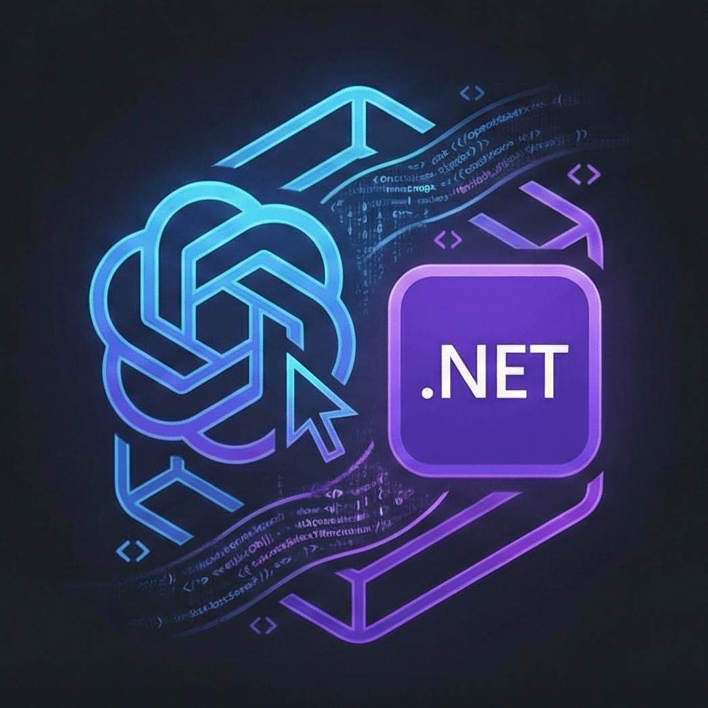

#  NCodexSDK

[](https://github.com/JKamsker/NCodexSDK/actions/workflows/ci.yml) [](https://www.nuget.org/packages/NC%C3%B2dexSDK)

<br clear="left"/>

A strongly-typed .NET client library for interacting with the Codex CLI, enabling programmatic control of AI coding sessions with full event streaming and session management.

## Features

### Core Capabilities
- **Strongly-typed session management** — Launch, monitor, and control Codex CLI sessions (`codex exec`) with type-safe options
- **Real-time event streaming** — Stream and parse JSONL session events with typed models
- **Session resumption** — Attach to historical sessions (read-only) or resume with new follow-up turns
- **Rate limit tracking** — Query current rate limits from recent session data
- **Extensible architecture** — Swap implementations via clean abstractions for testing and customization

### Event Types
The library provides typed models for all Codex session events:
- `SessionMetaEvent` — Session metadata and configuration
- `UserMessageEvent`, `AgentMessageEvent`, `AgentReasoningEvent` — Conversation flow
- `TokenCountEvent` — Token usage with embedded `RateLimits`
- `TurnContextEvent` — Turn-level context and state
- `ResponseItemEvent` — Normalized response items (reasoning, messages, function calls, ghost snapshots) with raw JSON fallback for forward compatibility

### Extensibility Points
All infrastructure is swappable via interfaces:
- `ICodexProcessLauncher` — Custom process management
- `ICodexSessionLocator` — Alternative session discovery strategies
- `IJsonlTailer` — Custom log tailing implementations
- `IJsonlEventParser` — Event parsing and normalization
- `ICodexPathProvider` — Configurable session paths
- `IFileSystem` — Filesystem abstraction for testing

## Installation

### Requirements
- .NET 10 SDK or later
- Codex CLI ≥ 0.60.1 installed and available on PATH (`codex` / `codex.cmd`)

### Install via NuGet
```bash
dotnet add package NCòdexSDK
```

## Usage

### Basic Session
```csharp
var clientOptions = new CodexClientOptions();
await using var client = new CodexClient(clientOptions);

var sessionOptions = new CodexSessionOptions("<workdir>", "Write a hello world program")
{
    Model = CodexModel.Gpt51Codex,
    ReasoningEffort = CodexReasoningEffort.Medium
};

await using var session = await client.StartSessionAsync(sessionOptions, CancellationToken.None);
await foreach (var evt in session.GetEventsAsync(EventStreamOptions.Default, CancellationToken.None))
{
    switch (evt)
    {
        case AgentMessageEvent msg:
            Console.WriteLine($"Agent: {msg.Content}");
            break;
        case ResponseItemEvent item when item.Payload.Message != null:
            var text = string.Join("", item.Payload.Message.Value.TextParts);
            Console.WriteLine($"[{item.Payload.Message.Value.Role}] {text}");
            break;
        case TokenCountEvent tokens:
            Console.WriteLine($"Tokens: {tokens.InputTokens} in, {tokens.OutputTokens} out");
            break;
    }
}
```

### Session Resumption

Attach to an existing session (read-only):
```csharp
await using var historical = await client.ResumeSessionAsync("session-id-here", CancellationToken.None);
// Stream historical events
```

Resume with a follow-up turn:
```csharp
var followUpOptions = sessionOptions.Clone();
followUpOptions.Prompt = "Now add error handling";
await using var resumed = await client.ResumeSessionAsync(session.Info.Id, followUpOptions, CancellationToken.None);
// Continue streaming events
```

### Rate Limit Monitoring
```csharp
var limits = await client.GetRateLimitsAsync(noCache: true, CancellationToken.None);
Console.WriteLine($"Requests remaining: {limits.RequestsRemaining}/{limits.RequestsLimit}");
Console.WriteLine($"Tokens remaining: {limits.TokensRemaining}/{limits.TokensLimit}");
Console.WriteLine($"Resets at: {limits.RequestsResetAt}");
```

### Response Item Normalization

`ResponseItemEvent` provides normalized payloads for common item types while preserving raw JSON for future compatibility:

```csharp
await foreach (var evt in session.GetEventsAsync())
{
    if (evt is ResponseItemEvent item)
    {
        switch (item.Payload)
        {
            case { Reasoning: var reasoning }:
                Console.WriteLine($"Reasoning: {reasoning.SummaryText}");
                break;
            case { Message: var msg }:
                var text = string.Join("", msg.TextParts);
                Console.WriteLine($"[{msg.Role}] {text}");
                break;
            case { FunctionCall: var call }:
                Console.WriteLine($"Function: {call.Name}({call.Arguments})");
                break;
            case { GhostSnapshot: var ghost }:
                Console.WriteLine($"Ghost: {ghost.Path} - {ghost.Action}");
                break;
            default:
                // Future payload types fall back to raw JSON
                Console.WriteLine($"Unknown: {item.Payload.Raw}");
                break;
        }
    }
}
```

## Demo Application

A sample console application is included at `src/NCodexSDK.Demo` to demonstrate library usage.

### Running the Demo
```bash
dotnet run --project src/NCodexSDK.Demo -- "Your prompt here"
```

The demo showcases:
- Rate limit querying and caching
- Starting a session with event streaming
- Resuming a session for follow-up turns
- Rendering different response item types

## Architecture

### Design Principles
- **Session log resolution:** Captures session ID from Codex stderr/stdout; resolves logs by ID first with time-based polling fallback for robustness
- **Typed response items:** `ResponseItemPayload` normalizes common payloads (reasoning, messages, function calls, ghost snapshots) while preserving `Raw` JSON for forward compatibility
- **Pluggable infrastructure:** All file system operations, path resolution, and process management use interfaces for testing and customization
- **Graceful shutdown:** `CodexSessionHandle.DisposeAsync` terminates live processes with configurable timeout

### Key Components

#### Client Layer (`CodexClient`)
Main entry point providing high-level session management, rate limit queries, and session resumption.

#### Process Management (`CodexProcessLauncher`)
Launches and monitors Codex CLI processes, captures session IDs, manages process lifecycle.

#### Event Streaming (`JsonlTailer`, `JsonlEventParser`)
Tails JSONL log files and parses events into strongly-typed models with payload normalization.

#### Session Handling (`CodexSessionHandle`)
Represents an active or historical session, provides event streaming, manages cleanup.

## Project Structure

### Source Code
- **`src/NCodexSDK/`** — Core library
  - `Public/CodexClient.cs` — Main client API
  - `Public/Models/` — Event models (`ResponseItemEvent`, `ResponseItemPayload`, etc.)
  - `Infrastructure/CodexProcessLauncher.cs` — Process management
  - `Infrastructure/JsonlEventParser.cs` — Event parsing and payload normalization
  - `Infrastructure/JsonlTailer.cs` — Log file streaming
  - `Abstractions/` — Interfaces for extensibility

- **`src/NCodexSDK.Demo/`** — Sample console application
  - `Program.cs` — Demonstrates rate limits, sessions, and resumption

### Tests
- **`tests/NCodexSDK.Tests/`**
  - `Unit/ResponseItemEventTests.cs` — Response item parsing tests
  - `Integration/CodexClientStartSessionTests.cs` — End-to-end session tests
  - Complete coverage for process launch, parsing, and client behavior

## Extending Response Item Support

To add support for new `response_item` payload types:

1. Extend `NormalizeResponseItemPayload` in `JsonlEventParser.cs`
2. Add new properties to `ResponseItemPayload` record
3. Raw JSON is automatically preserved for unknown types

Example:
```csharp
// In JsonlEventParser.cs
private static ResponseItemPayload NormalizeResponseItemPayload(JsonElement raw)
{
    // Add new case
    if (raw.TryGetProperty("my_new_type", out var newType))
    {
        return new ResponseItemPayload(Raw: raw, MyNewType: ParseNewType(newType));
    }
    // ... existing cases
}
```

## Troubleshooting

### Build Issues
- **File locked during build:** Stop any running demo processes:
  ```powershell
  Get-Process NCodexSDK.Demo | Stop-Process -Force
  ```

### Runtime Issues
- **Session log not found:** Ensure Codex CLI is installed and `%USERPROFILE%\.codex\sessions` exists. The library uses ID-based lookup first, with time-based fallback for reliability.
- **Process launch fails:** Verify `codex` is on your PATH by running `codex --version` in a terminal.

## Roadmap
- Additional typed projections for emerging `response_item` payload types
- Rate limit tracking and display helpers
- NuGet package distribution

## License & Contributing
See the repository for license details. Contributions welcome — please open issues or pull requests for bugs, features, or documentation improvements.
